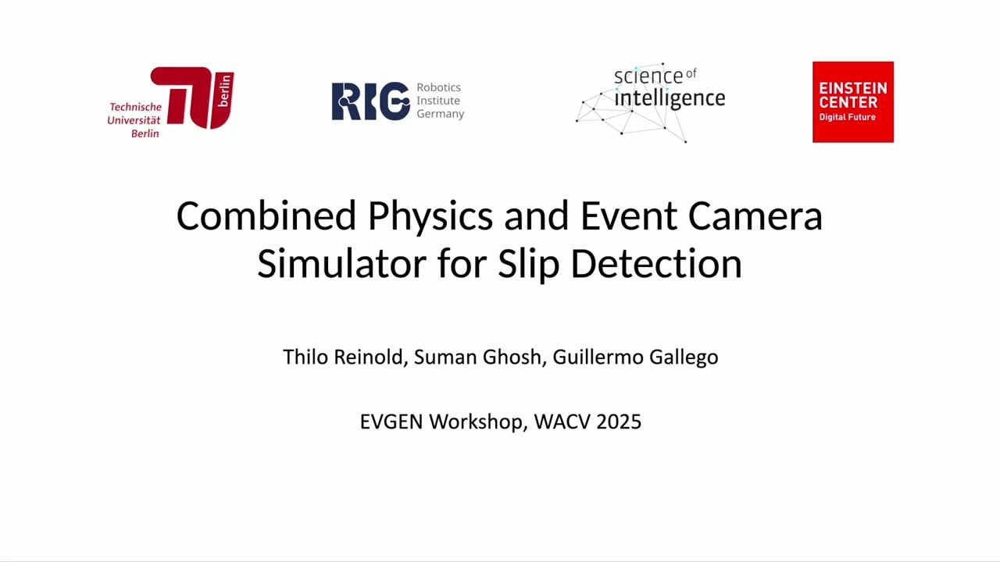

# EVGEN: Combined Physics and Event Camera Simulator for Slip Detection

Official repository for [**EVGEN: Combined Physics and Event Camera Simulator for Slip Detection**](https://arxiv.org/pdf/2408.15605), by Thilo Reinold, [Suman Ghosh](https://www.linkedin.com/in/suman-ghosh-a8762576/) and [Guillermo Gallego](https://sites.google.com/view/guillermogallego), published at the **Winter Conference on Applications of Computer Vision (WACV) Workshops 2025** Tucson, Arizona.
<h2 align="left">
  
<!--- [Paper]() | [Video](https://youtu.be/U4eAC0ao2R8) | [Poster]() --->
[Video](https://youtu.be/U4eAC0ao2R8)
</h2>

