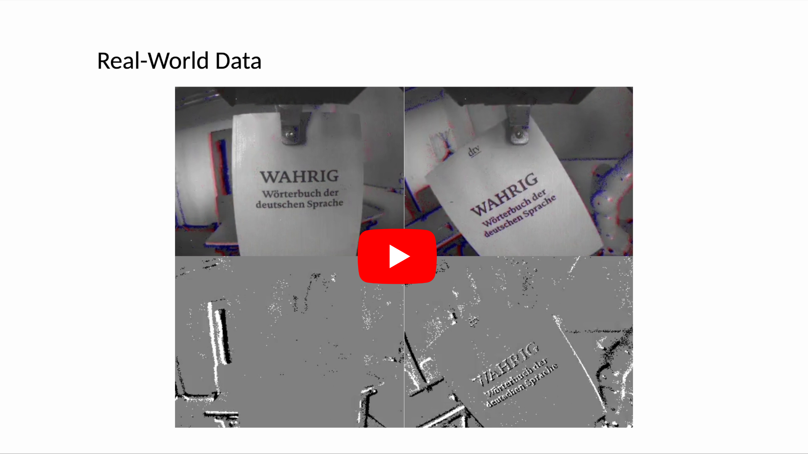

# Combined Physics and Event Camera Simulator for Slip Detection

Official repository for [**Combined Physics and Event Camera Simulator for Slip Detection**](http://doi.org/10.1109/WACVW65960.2025.00104), by Thilo Reinold, [Suman Ghosh](https://www.linkedin.com/in/suman-ghosh-a8762576/) and [Guillermo Gallego](http://www.guillermogallego.es), published at the IEEE/CVF Winter Conference on Applications of Computer Vision **(WACV)** Workshops 2025, Tucson, USA.
<h2 align="left">
  
[Paper](https://arxiv.org/pdf/2503.04838) | [Video](https://youtu.be/U4eAC0ao2R8) | [Poster](250226_WACV_EVGEN_poster.pdf)
</h2>

[](https://youtu.be/U4eAC0ao2R8)

## Citation

If you use this work in your research, please cite it as follows:

```bibtex
@InProceedings{Reinold25wacvw,
  author    = {Thilo Reinold and Suman Ghosh and Guillermo Gallego},
  title     = {Combined Physics and Event Camera Simulator for Slip Detection},
  booktitle = {{IEEE/CVF} Winter Conf. Applications of Computer Vision (WACV) Workshops},
  month     = {Feb.},
  year      = {2025},
  pages     = {872--880},
  doi       = {10.1109/WACVW65960.2025.00104}
}
```

## Code

Code will be released soon.

## Additional Resources

* [Research page (TU Berlin, RIP lab)](https://sites.google.com/view/guillermogallego/research/event-based-vision)
* [Course at TU Berlin](https://sites.google.com/view/guillermogallego/teaching/event-based-robot-vision)
* [Survey paper](http://rpg.ifi.uzh.ch/docs/EventVisionSurvey.pdf)
* [List of Event-based Vision Resources](https://github.com/uzh-rpg/event-based_vision_resources)
